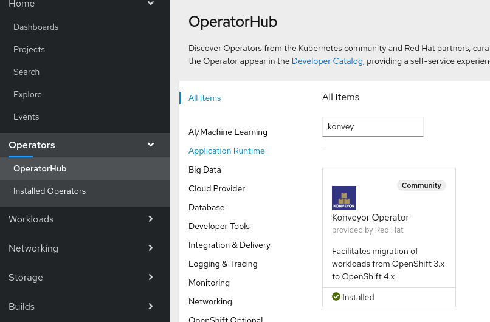
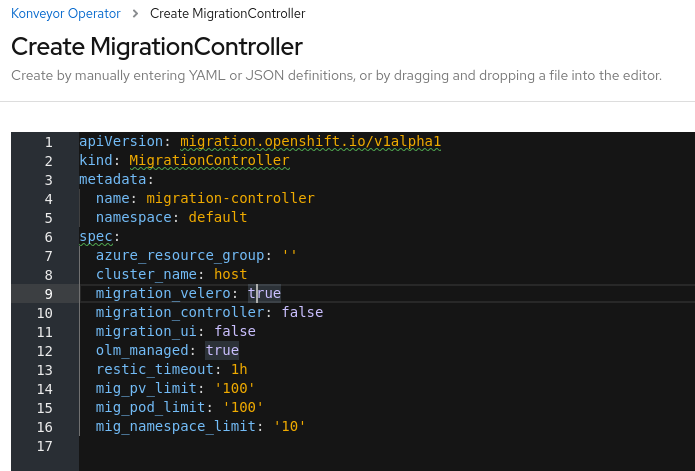
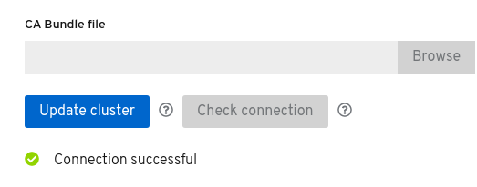
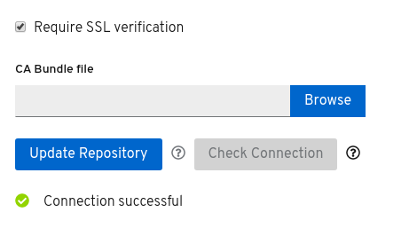

# Using a 3.x Cluster as a CAM Control Cluster

## Pre-requisites

* podman must be installed and working, authenticated to `registry.redhat.io`
* A 3.x cluster containing workloads you're interested in migrating to a 4.x cluster
* Intermediary S3 based storage
* A healthy 4.x cluster ready to accept migrated workloads

## Introduction

As mentioned in my previous disconnected cluster blog, there are a number of
different topologies one can configure CAM depending on what makes sense for
their particular use case. Before starting, I'm going to borrow the cluster
designation definitions from my disconnected blog so we can get a baseline
language established:

> 1) A **control cluster** that contains all CAM components: the controller which
orchestrates migrations and presents the CAM API surface to the cluster that it
has been installed in, the UI from which a user can drive a migration, and the
underlying velero installation that will be used to backup/restore a migrated
application.
>
> 2) A **remote cluster** that runs the underlying velero infrastructure which accepts
instructions from the control cluster to export or import a running workload.
The controller and UI components should be disabled in a remote cluster. One additionally
unique property of a remote cluster is that a "mig" `ServiceAccount` is created
and is granted a `cluster-admin` binding. This `ServiceAccount` token is registered
along with the coordinates to the remote cluster with the control cluster so that
the control cluster's "controller" may interface with the remote cluster's APIs
acting as that `ServiceAccount`.

Under most circumstances, users of CAM will use their 4.x cluster as their
**control cluster**. However, the focus of this blog is to cover using a 3.x
cluster as the CAM control, which is also hosting the application workloads
that you would like to migrate to a 4.x **remote** cluster. There are a few
differences that must be configured to enable this, so let's get started.

## Configuring a 4.x cluster as a remote cluster
Since 4.x clusters ship with OLM installed and have Konveyor (our upstream offering)
automatically made available for installation, we'll use this to set up the 4.x
cluster as a **remote cluster** in this scenario. Additionally, be sure your
cli tools are configured contextually to work with this 4.x cluster.

First, you'll need to create an `openshift-migration` namespace to host our
various components. NOTE: This must be done with either
`oc create ns openshift-migration`, or created via the **namespace** creation
section of the UI. You CANNOT create a project with the prefix "openshift-";
it will be rejected by the project server.

Navigating to the OperatorHub dropdown on the left, be sure to select your
active namespace to be `openshift-migration` and search for Konveyor.



For the purposes of this article, we're going to use latest which is the bleeding
edge code out of our master repos, but you also have 1.0 and 1.1 stable branches
available.

Ensure you have selected `openshift-migration` as the namespace to install the
operator inside of, select latest as the package channel, and click subscribe.
You should see an operator pod spin up inside of the namespaces workloads.

### Installing 4.x in "Remote Cluster" mode

Next step is to tell the CAM operator to deploy all of the requisite operands,
which will be different when running in **Remote Cluster** mode. In this case,
we don't need a UI or the controller. Create a `MigrationController` object
to tell the operator you intend for an instance of CAM to be deployed, but by
default you will see the UI and controller both switched on. Set both to false,
and create the `MigrationController`.

```
migration_controller: false
migration_ui: false
```



After waiting a bit, you should see the operator roll out restic pods for each of
your nodes, in addition to Velero. You will also have Velero's API surface now
available for the controller that will live inside your 3.x cluster to communicate
with. NOTE: There is no controller or UI pod present. However, if you run:

`oc get sa -n openshift-migration`, you will see a `mig` sa token that will
be used to connect this cluster as a target cluster to your **control cluster**
(the 3.x cluster), after it has been installed in that cluster.

## Configuring a 3.x cluster as a Control Cluster
Now that we're going to configure the 3.x cluster, reset your oc context to
point to the 3.x cluster. I prefer to keep my kubeconfig files separate, and
switch between the two using the KUBECONFIG environment variable, or keep
two tmux panes open simultaneously configured to each.

Although CAM uses its operator to install and manage the lifecycle of the tool,
OLM is not present by default in a 3.x cluster and must be manually installed
and configured. First, we're going to download the `operator.yml` manifest file, as
well as a default `controller-3.yml` that will be used to tell the operator to
configure the 3.x cluster as a **control cluster** for CAM. Be sure to put these
in a known location.

```
wget https://raw.githubusercontent.com/konveyor/mig-operator/master/deploy/non-olm/latest/operator.yml
wget https://raw.githubusercontent.com/konveyor/mig-operator/master/deploy/non-olm/latest/controller-3.yml
```

If you were using the 3.x cluster as a **remote cluster**, the default values
inside of the `controller-3.yml` would work as-is. However, we're interested
in using the 3.x cluster as a **control cluster**, so some modifications to the
file are required. First, we're going to want to switch on the controller and
the UI. You'll also note the commented out section stating that if you are
going to run the controller on a 3.x cluster, you need to manually provide
the API server coordinates as an argument to the operator. To get this value,
you can run `oc cluster-info` and take the full URL reported. Here's my output,
stripped of details of course:

```
# o cluster-info
Kubernetes master is running at https://master.foo.bar.baz.com:443
[...SNIP...]
```


Example:

```
apiVersion: migration.openshift.io/v1alpha1
kind: MigrationController
metadata:
  name: migration-controller
  namespace: openshift-migration
spec:
  azure_resource_group: ''
  cluster_name: host
  migration_velero: true
  migration_controller: true
  migration_ui: true
  restic_timeout: 1h
  # Obviously replace the below with your cluster's actual API URL
  mig_ui_cluster_api_endpoint: https://master.foo.bar.baz.com:443
```

At this point you should see a full **control cluster** deployment in the
`openshift-migration` namespace of your 3.x cluster:

```
# o get pods
NAME                                   READY   STATUS    RESTARTS   AGE
migration-controller-f75955f87-2mfk4   2/2     Running   0          1m
migration-operator-77b7b5c7fd-mvf4b    2/2     Running   0          13m
migration-ui-6cb6954c9c-grd2m          1/1     Running   0          1m
restic-fnb65                           1/1     Running   0          5m
restic-mrnxn                           1/1     Running   0          5m
restic-pmrbk                           1/1     Running   0          5m
restic-zcdbd                           1/1     Running   0          5m
velero-74f5f6d78-n5tpx                 1/1     Running   0          5m
```

### CORS configuration

One of the primary reasons we recommend users NOT use a 3.x cluster as a
**control cluster** is that it requires [manual CORS configuration](https://docs.openshift.com/container-platform/3.11/architecture/infrastructure_components/web_console.html#overview) of the
master config to specifically whitelist the migraiton UI, allowing API requests
from what's configured an alternative origin. If a 4.x cluster is used as a
**control cluster**, the operator is capable of transparently handling this
configuration.

First, you want to generate the correct regex string to set in the openshift
configuration. This can be produced with the following command:

`oc get -n openshift-migration route/migration -o go-template='(?i)//{{ .spec.host }}(:|\z){{ println }}' | sed 's,\.,\\.,g'`

Output from this command will look something like this, but will be different for every cluster:
(?i}//migration-openshift-migration\.apps\.foo\.bar\.baz\.com(:|\z)

Add the output to /etc/origin/master/master-config.yaml under corsAllowedOrigins, for instance:

corsAllowedOrigins:
- (?i}//migration-openshift-migration\.apps\.foo\.bar\.baz\.com(:|\z)

After making these changes on 3.x you'll need to restart OpenShift components to
pick up the changed config values. The process for restarting 3.x control plane
components differs based on the OpenShift version.

> In OpenShift 3.7-3.9, the control plane runs within systemd services
> $ systemctl restart atomic-openshift-master-api
> $ systemctl restart atomic-openshift-master-controllers


> In OpenShift 3.10-3.11, the control plane runs in 'Static Pods'
> /usr/local/bin/master-restart api
> /usr/local/bin/master-restart controllers

## Executing a migration from 3.x to 4.x

To get the route for the migration UI, run:

`o get routes -n openshift-migration migration`

Login via your cluster admin account. You will have only one cluster registered
automatically, and that's the "host" cluster, or 3.x cluster you are using
as your **control cluser**. The next step is to register your 4.x cluster.

### Registering your 4.x remote cluster
Using the cli tools configured to talk to the 4.x cluster, you'll need the
coordinates to the API server, as well as the SA token that we mentioned
earlier so our controller can communicate with it from within 3.

Click Add Cluster and you should be presented with a dialog.
Running `o cluster-info` on your 4.x cluster should provide you the URL to use.

To export the mig `ServiceAccount` token the controller will use to communicate
with your **remote cluster**, on your 4.x cluster, run:

`o sa get-token mig -n openshift-migration`

> NOTE: Ensure you enter this value *precisely* with no whitepace

Uncheck Require SSL Verification if this is a self-signed cluster, and click
Add Cluster. At this point you should see a successfully registered 4.x cluster.



### Registering a Replication Repository

This step does not differ from a normal topology of 4.x being the **control cluster**,
but we can quickly add a legitimate S3 bucket to act as intermediary storage:

Click the Add button to add a Replication Repository and choose S3 from the dropdown.
We'll use a standard Amazon S3 bucket.

* Fill in a unique name for your repo
* Fill in the amazon provided bucket name
* Fill in the region that the bucket resides in (us-west-1 for me)
* You can safely ignore the endpoint since this is not a self-hosted S3 instance
and the amazon location is known
* Fill in your access key, and secret access key values for the bucket
* Here we can check "Require SSL Verification" since we'll want to verify the
Amazon S3 CA. NOTE: If you were using self-hosted S3, you would have an opportunity
to upload your own custom CA and ensure that it's verified.

With all going well, we should now also have a Replication Repo ready to be used:



### Executing a migration

The next step is to create a Migration Plan to describe where, and what you
would like to migrate. Click Add Plan, and give your plan a unique name.

!TODO: UI is currently filtering "host" clusters from being allowed as source
clusters. Need source change in the UI to allow for this.
https://github.com/konveyor/mig-ui/pull/735

!ISSUE, during PV discovery, controller is missing some RBAC to do PV disco
    - category: Critical                                                                                                       
      lastTransitionTime: "2020-03-11T17:24:51Z"                                                                               
      message: 'Reconcile failed: [customresourcedefinitions.apiextensions.k8s.io                                              
        is forbidden: User "system:serviceaccount:openshift-migration:migration-controller"                                    
        cannot list customresourcedefinitions.apiextensions.k8s.io at the cluster                                              
        scope: no RBAC policy matched]. See controller logs for details.'                                                      
      status: "True"                                                                                                           
      type: ReconcileFailed   

# TODO:
* Consistent branding, use CAM or Konveyor?
* Get rid of 'o' alias
